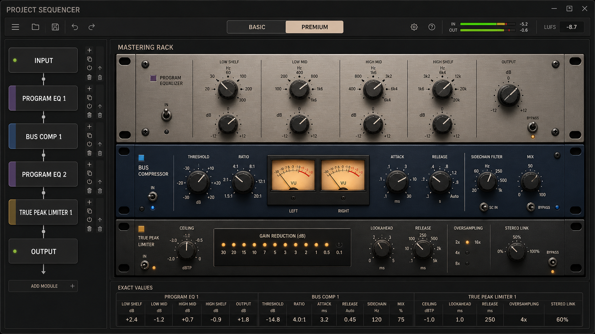
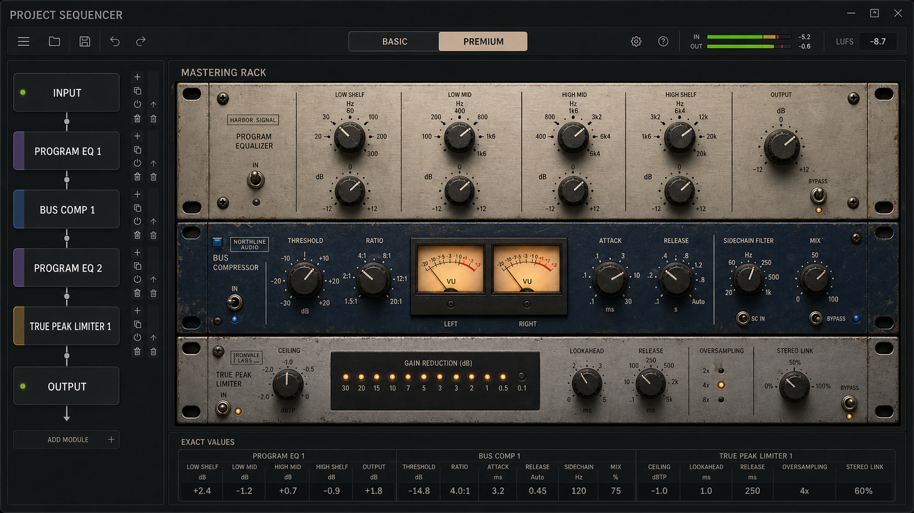
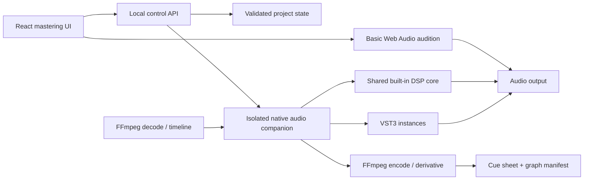

# Advanced Mastering Equipment and Audio Pipeline Plan

Plan date: 2026-08-11 · implementation and visual follow-up updated 2026-08-12

Status: ownership-aware serial plug-in rack, spatial/creative built-ins,
monitoring, Web Audio audition, authoritative FFmpeg prints, native Electron
shell POC, and shared DSP contract POC implemented; analog-modelled native DSP
and the isolated native VST3/AU host remain planned; not a release approval

The follow-up analog faceplate and interaction brief for every new built-in is
maintained in
[MASTERING-PLUGIN-VISUAL-DESIGN-NOTES.md](./MASTERING-PLUGIN-VISUAL-DESIGN-NOTES.md).



The aged-hardware refinement is now the direct premium-equipment visual source.
Its control-free faceplates are prepared as project assets, while semantic
controls and live meter needles remain interactive layers:



## Implementation checkpoint — 2026-08-11

Implemented on the `codex/advanced-mastering-rack` branch:

- Schema 6 keeps `album.masterBus` intact, migrates every existing album with
  `masteringPath: basic`, and adds an independent normalized Premium rack.
- The serial rack supports up to 16 built-in plug-in instances with insert,
  duplicate, drag reorder, arrow reorder, bypass, remove, reset, and exact-value
  controls.
- Stored `nodes` plus canonical `connections` form one input-to-output chain.
  Invalid types, duplicate identifiers, unsafe values, and non-serial
  connections fail validation.
- The browser live path uses a preallocated processor-slot pool so reordering
  does not recreate the media source or interrupt the shared transport. Basic
  and Premium audition paths remain separately gain-routed, and clean
  references/rendered previews retain their direct bypass.
- The authoritative FFmpeg graph consumes the same ordered Premium nodes.
  Limiter prints support 2x, 4x, or 8x processing rate and return to the
  documented 48 kHz output. Cue sheets and schema-3 render manifests record the
  selected tier, rack order, bypass state, parameters, and connections.
- The premium equipment uses control-free edits derived from the accepted v2
  mockup for its faceplates, screws, labels, rack ears, wear, and surface
  texture. The compressor uses the separately supplied photoreal v3 dual VU
  housing. Native accessible controls replace photographed hardware at its
  exact centers and live needles animate inside the pictured VU, so no knob,
  switch, lamp, or meter reading appears doubled.
- Unit, state-migration, live-graph, FFmpeg integration, and rendered browser
  coverage prove repeated instances, drag-to-repatch persistence, Basic/Premium
  isolation, oversampled printing, mobile containment, and source checksums.

Still intentionally gated:

- Installed VST3 or AU binaries are not loaded by the browser or Node server.

Implemented in the schema-7 plug-in wave:

- One catalog and rack-node contract now covers all included processors and
  preserves future VST3/AU identities, vendors, availability, and bounded opaque
  state. Missing native instances stay visible, unavailable, and bypassed.
- Stereo/mono/Mid/Side audition monitoring, vectorscope display, and phase
  correlation are post-master and are never written into a print.
- Program EQ and Bus Compressor accept Stereo, Mid, or Side targeting.
- Stereo Field Matrix, Harmonic Color, static Phase Alignment, HF Smoother,
  Mastering Ambience, Transient Sculptor, and clearly warned Creative Phaser
  are addable/removable/reorderable/duplicable plug-ins.
- Live Web Audio audition and authoritative FFmpeg printing consume the same
  ordered node list. A real short integration print exercises every new module
  while checksum verification proves the indexed source remains unchanged.
  The UI names this boundary instead of pretending a third-party processor is
  active. Phase 5 still requires the isolated, signed native companion, SDK and
  license review, crash recovery, latency compensation, state chunks, and a
  generic fallback editor.
- The built-in rack extends the proven Basic Web Audio/FFmpeg algorithms with
  two independently processed mid bands, per-EQ output trim, order,
  repetition, detector high-pass sidechain compression, continuously variable
  limiter stereo linking, limiter print oversampling, and complete hardware
  interaction. The C++ analog-modelled DSP core, BS.1770 true-peak
  qualification, external key input, and colored compressor modes remain Phase
  3 work and must not be claimed as complete.

Native/DSP POC checkpoint on `codex/native-dsp-poc`:

- The existing production Node server and built React UI can launch as one
  Electron desktop application with isolated application data and a random
  loopback port.
- All current FFmpeg/ffprobe call sites accept an executable supplied by the
  desktop host, which is the first step toward a bundled media-tool runtime.
- Shared DSP contract v2 runs the same JavaScript kernel through an
  AudioWorklet adapter and a Node host adapter. It proves gain, smoothing,
  exact bypass, sample-peak guarding, optional DC blocking, sample-rate reset,
  non-finite recovery, and versioned golden parity across multiple block sizes
  and sample rates. It is lab-gated and is not connected to the production
  transport or print path.
- A SwiftPM native implementation now passes the complete contract-v2 golden
  set at every verified block size. A muted Core Audio laboratory now proves
  lifecycle, recovery, lock-free telemetry, generated shared-DSP shadow work,
  and a coherent atomic parameter mailbox in optimized release builds. It still
  emits only silence and has no physical hot-plug, WASM, user-media, or
  production transport connection; stack logging also finds one first-callback
  Swift TLS allocation.
- Packaging remains unsigned and uses installed FFmpeg. Google login, paid
  entitlements, native device I/O, true-peak DSP, and external plug-in hosting
  remain outside this checkpoint. See
  [NATIVE-DSP-POC.md](./NATIVE-DSP-POC.md) and
  [SHARED-DSP-CONTRACT.md](./SHARED-DSP-CONTRACT.md).

## Faceplate control duty audit — 2026-08-12

The Premium UI intentionally presents the equipment as real studio hardware.
It does not expose engineering caveats on the faceplate. This section is the
authority for controls whose current signal duty differs between browser live
audition and the authoritative printed result.

| Equipment control | Interaction and persistence | Browser live path | FFmpeg print path |
| --- | --- | --- | --- |
| EQ low shelf frequency/gain | Knobs move and save | Real biquad shelf | Real `lowshelf` |
| EQ low-mid frequency/gain | Knobs move and save | Real peaking band | Real `equalizer` band |
| EQ high-mid frequency/gain | Knobs move and save | Real peaking band | Real `equalizer` band |
| EQ high shelf frequency/gain | Knobs move and save | Real biquad shelf | Real `highshelf` |
| EQ output | Knob moves and saves | Real gain stage | Real volume stage |
| Compressor threshold, ratio, attack, release, mix | Knobs move and save | Real Web Audio compression | Real `acompressor` parameters |
| Compressor sidechain filter and SC IN | Knob, switch, and lamp move, toggle, and save | Real bass-exclusion compression: adjustable complementary low/high paths preserve the low program band while compression acts above the crossover | Real split detector branch through `highpass` into `sidechaincompress`; program bass remains full-range |
| Compressor makeup, knee, detection, and link exact controls | Controls save | Makeup and knee are real; detector/link behavior follows Web Audio's fixed implementation | Real `acompressor` makeup, knee, detection, and link parameters |
| Compressor VU needles | Live measured animation | Reads the active compressor reduction | Reflects live audition only; prints record settings, not meter animation |
| Limiter ceiling, lookahead, and release | Knobs move and save | Real limiter threshold/time constants using the browser's approximate dynamics stage | Real `alimiter` ceiling, attack/lookahead, release, and latency handling |
| Limiter 2x, 4x, and 8x selector lamps | Each lamp button toggles and saves | Selection is retained; the audio device rate is unchanged | Real upsample → limit → 48 kHz downsample print path |
| Limiter stereo link | Knob moves and saves | Real unity-safe linear crossfade between linked stereo limiting and independent left/right limiters | Real unity-safe linear blend of linked `alimiter` and independent channel limiters |
| Limiter gain-reduction lamps | Live measured animation | Reads active limiter reduction | Reflects live audition only; prints record settings, not lamp animation |
| IN, BYPASS, power, and status lamps | Switches toggle; lamps follow the circuit state | Real processor/rack bypass routing | Bypassed nodes are omitted from the print graph |
| Master Output level and IN switch | Knob/switch move and save | Real gain and bypass | Real volume stage and bypass |

Knobs remain adjustable while a processor or the complete rack is bypassed, as
on physical hardware. Those edits become audible when the circuit returns IN.
Printed legends, screws, rack ears, logos, and fixed scale marks are decorative
faceplate artwork rather than controls.

## Product decision

Project Sequencer should have two clearly separate mastering levels:

- **Basic** keeps the current Equalizer, Compressor, Output, and Limiter exactly
  as the approachable fixed MASTER chain. Existing albums, presets, live
  audition behavior, and FFmpeg prints remain compatible.
- **Premium / Advanced** adds a realistic, brand-neutral equipment rack, a
  reusable processor graph, multiple instances of built-in equipment, and a
  native plug-in-hosting boundary for external VST3 effects.

Premium must be more than a visual skin. It should add higher-fidelity DSP,
more realistic control behavior, true-peak protection, professional routing,
better metering, reproducible prints, and the fault isolation needed for
third-party plug-ins. The premium look and premium sound should ship together;
the application should not market recolored Basic algorithms as analog
modeling.

The recommended first Premium release is a **serial mastering rack** with
multiple built-in instances. Parallel buses, sidechains, Audio Units, CLAP, and
web plug-ins follow after the serial rack and VST3 host are proven.

## Current baseline to preserve

The repository already has a strong first mastering foundation:

- `src/components/MasteringControls.jsx` presents the fixed EQ, compressor,
  output, and limiter modules with knobs, exact numeric controls, curves, live
  gain reduction, presets, and accessible form elements.
- `src/lib/live-mastering.js` builds one browser Web Audio graph for track gain,
  three-band EQ, dry/wet compressor, output gain, limiter, and metering.
- `server/audio-renderer.mjs` builds the authoritative FFmpeg processing graph
  for previews and 24-bit/48 kHz album or track prints.
- `src/lib/mastering.js` normalizes the current `album.masterBus` settings and
  keeps parameter limits explicit.
- `server/state-schema.mjs` validates the current MASTER bus and presets within
  schema version 5.
- Raw library auditions and clean references bypass MASTER processing;
  rendered previews bypass the live graph to prevent double processing.
- Indexed source audio remains read-only and every print is a derivative under
  `exports/YYYY-MM-DD/` with a cue sheet and manifest.

This baseline becomes the Basic tier. Premium must extend it without changing
the sound, state, or authority of an existing Basic project.

## Goals

1. Make the Premium EQ, compressor, and limiter look and behave like credible
   physical mastering equipment without copying a real product or trademark.
2. Let the operator insert, reorder, duplicate, bypass, compare, and remove
   multiple processor instances between MASTER input and output.
3. Keep real-time audition and authoritative print results closely aligned and
   make any known differences explicit.
4. Host approved external VST3 effects through an isolated native companion,
   not inside the browser or Node server process.
5. Preserve plug-in state, parameter values, routing, latency, engine version,
   and equipment fingerprints well enough to reproduce a print later.
6. Keep the current Basic workflow simple and immediately available.
7. Retain exact-value controls, keyboard operation, touch alternatives,
   reduced-motion behavior, and readable compact layouts alongside the
   realistic hardware presentation.
8. Continue to treat audition, derivative print, approved master, and release
   readiness as separate decisions.

## Non-goals for the first release

- Replacing a full DAW, recording multitrack audio, or adding instruments/MIDI
- Loading old VST2 plug-ins
- Automatically scanning arbitrary folders or loading unknown binaries at
  startup
- Cloud plug-in libraries, accounts, remote processing, or DRM management
- Sample-accurate parameter automation in the first rack release
- Parallel routing, feedback loops, or arbitrary channel formats in the first
  rack release
- Bundling third-party plug-in binaries with a project
- Automatically normalizing, mastering, approving, or publishing source audio

The first Advanced graph belongs to the album MASTER bus. Existing per-track
gain, trims, fades, and transitions remain upstream. The same node contract can
support optional per-track insert racks later, but adding them to the first
release would multiply plug-in instances, latency, render semantics, and CPU
risk before the MASTER path is proven. Physical hardware send/return loops are
also a separate future capability, not part of the internal INPUT/OUTPUT rack
routing in this plan.

## Experience concepts

### Concept A — Studio Mastering Rack (recommended)

A dark 19-inch rack with realistic unit heights, rack ears, screws, brushed
metal, engraved scales, dimensional knobs, toggle switches, meter glass, and
subtle wear. A separate signal-chain lane shows every instance from INPUT to
OUTPUT. Selecting a unit expands its exact values and technical controls.

Why it fits: it makes the physical signal path immediately understandable,
supports repeated instances naturally, and works with both built-in equipment
and generic external plug-in cards.

### Concept B — Heritage Broadcast Desk

Warm cream and muted green faceplates, large mechanical VU meters, chunky
stepped controls, guarded switches, and minimal digital displays. This is the
most tactile concept, but it uses more vertical space and can obscure dense
technical options.

Use it as an optional equipment finish or theme, not the only Premium layout.

### Concept C — Precision Lab Rack

Graphite panels, encoder rings, calibrated LED ladders, transfer plots, and
compact parameter readouts. This is the clearest option for measurements,
true-peak limiting, and external plug-ins, but it feels less distinctly analog.

Use it for the limiter, metering, and generic plug-in shell inside Concept A.

### Visual design rules

- Use original, brand-neutral faceplates. Borrow broad physical traits, never a
  manufacturer logo, exact panel layout, product name, or trade dress.
- For the accepted v2 premium rack, use the mockup faceplate slices as the
  visual layer and keep code-native controls as the interactive layer.
- Respect physical logic: labels align to controls, ticks follow actual ranges,
  switches have discrete states, meters show measured signals, and indicator
  lamps illuminate only when their state is active.
- Keep texture restrained. Metal grain, shadow, panel depth, reflection, and
  small wear should improve material recognition without reducing readability.
- Keep all decorative layers `aria-hidden`; the operable layer remains native
  buttons, ranges, selects, and numeric inputs.
- On phones, show the chain plus one selected module at a time. Do not shrink a
  full 19-inch faceplate into unusable miniature controls.

## Basic and Premium boundary

| Capability | Basic | Premium / Advanced |
| --- | --- | --- |
| Current project compatibility | Always | Opt-in per album |
| Chain | Fixed EQ → Compressor → Output → Limiter | Ordered rack instances |
| Multiple instances | No | Yes |
| Current Web Audio / FFmpeg behavior | Preserved | New shared DSP/native path |
| Equipment appearance | Current compact modules | Realistic 19-inch faceplates |
| Exact numeric controls | Yes | Yes |
| Built-in presets | Current component/MASTER presets | Per-instance and full-rack presets |
| External VST3 | No | Native companion required |
| Parallel routing | No | Later Advanced Graph phase |
| Authoritative print | FFmpeg filters | Native rack processor + FFmpeg encode |
| Missing plug-in behavior | Not applicable | Visible placeholder; print blocked by default |

The Basic/Premium selector changes which stored path is active; it does not
destroy either path. Operators can A/B the Basic and Premium paths at matched
output loudness before choosing one.

## Premium equipment concepts

### 1. Program Equalizer

Purpose: broad, musical MASTER shaping with stepped repeatable settings.

Initial controls:

- Low cut and high cut filters
- Four bands: low shelf, low-mid bell, high-mid bell, high shelf
- Stepped frequency choices and 0.5 dB gain detents, with an optional continuous
  fine mode
- Proportional-Q option for the bell bands
- Stereo, dual-mono, and mid/side operation
- Input drive and output trim with level-matched bypass
- Analyzer overlay that can be hidden so the panel still behaves like hardware

Sonic requirements:

- Minimum-phase filters for the first model
- Oversampled nonlinear stage only when Drive is enabled
- Frequency-response and phase-response test vectors at every sample rate
- No hidden automatic gain compensation unless explicitly enabled

### 2. Program Bus Compressor

Purpose: controlled album cohesion rather than track-level loudness repair.

Initial controls:

- Threshold, ratio, attack, release, makeup gain, and parallel mix
- Auto/program-dependent release
- Sidechain high-pass filter
- Stereo-link amount and left/right gain-reduction meters
- Three original behavior modes: Clean VCA, Tube Program, and Optical Level
- Level-matched bypass and optional auto makeup that is clearly labeled
- Calibration control for the VU meters, defaulting to `0 VU = -18 dBFS`

Sonic requirements:

- Separate peak/RMS or program-dependent detector behavior per model
- Click-free time-constant and ratio changes
- Correct stereo-link behavior and documented detector topology
- Harmonic coloration off by default in Clean VCA and explicit in colored modes
- Measured attack, release, knee, THD+N, and aliasing test fixtures

### 3. True-Peak Limiter

Purpose: final peak control and inter-sample-peak protection, not automatic
loudness maximization.

Initial controls:

- Ceiling in dBTP, input/drive, lookahead, and release
- Transparent, Balanced, and Dense release behaviors
- 2x, 4x, and 8x oversampling choices with a quality/CPU indicator
- Stereo-link and transient-preservation controls
- True-peak input/output meters and gain-reduction history
- Optional DC blocker and final dither only when reducing integer bit depth

Sonic requirements:

- True-peak measurement aligned with ITU-R BS.1770-5
- No oversampled clipping above the selected ceiling within documented tolerance
- Latency reported in samples and compensated in live and offline graphs
- Tail and lookahead flushed correctly at track and program boundaries
- Dither never applied twice and never applied to floating-point intermediate data

### Later Premium modules

- Precision Parametric EQ with dynamic bands
- Dedicated Optical Leveler and FET Peak Controller
- Transformer/console color stage with level-matched drive
- Stereo utility with width, balance, mono-maker, phase, and correlation
- Loudness/true-peak analyzer node that never changes audio

These later modules should use the same node contract; they should not require a
new persistence or routing design.

## Control behavior

- Drag vertically on a knob for coarse change; hold Shift for fine change.
- Arrow keys change one step; Shift+Arrow uses the fine step; Home/End reach the
  safe limits; a labeled Reset action restores the default.
- Double-click reset may be offered as a convenience but cannot be the only reset
  path.
- Stepped hardware controls snap visibly and audibly only to their legal values.
- Every knob has an always-available exact value, unit, range, default, and
  accessible name.
- Parameter changes use smoothing or graph crossfades to prevent clicks.
- Meters follow intentional ballistics; they do not merely animate toward random
  values. Paused equipment settles to an idle state.
- A rack A/B snapshot captures parameters and routing without changing master
  approval.
- Undo/redo treats add, remove, reorder, duplicate, bypass, preset load, and
  parameter commits as bounded project commands.

## Routing experience

### Serial Rack — first release

The primary editor is a clear ordered list:

```text
MASTER INPUT
  -> [Program EQ 1]
  -> [Bus Compressor 1]
  -> [Program EQ 2]
  -> [External VST3: selected plug-in]
  -> [True-Peak Limiter 1]
  -> [Meter / Analyzer]
  -> MASTER OUTPUT
```

Each insert supports:

- Add before/after
- Drag reorder plus Move Up/Move Down keyboard controls
- Duplicate with a new instance ID and copied settings
- Hard bypass and level-matched compare bypass where supported
- Rename instance without changing the equipment type
- Save/load an instance preset
- Copy/paste settings between compatible instances
- Remove with undo; no modal is needed because the operation is recoverable
- CPU, latency, oversampling, channel mode, and availability status
- Open Equipment Panel or Open Native Plug-in Window

The rack always has one protected input and one protected output. Version 1 is
stereo, acyclic, and serial. The limiter is recommended last but not forcibly
locked there; the application warns when the final active stage does not provide
true-peak protection.

### Advanced Graph — later release

Add a separate graph view after serial processing is stable:

- Split and merge nodes for parallel compression or wet/dry processing
- Mid/side encoder and decoder nodes
- External sidechain input ports
- Per-branch gain, polarity, mute, and latency display
- Automatic plug-in delay compensation across branches
- Cycle prevention; feedback is not supported
- Graph overview plus a linearized accessibility list representing the same
  connections

The serial rack should remain the default even after the graph exists.

## Proposed persisted model

Introduce schema version 6 while retaining `album.masterBus` unchanged:

```json
{
  "masteringPath": "basic",
  "masterBus": {},
  "advancedMastering": {
    "graphVersion": 1,
    "inputNodeId": "master-input",
    "outputNodeId": "master-output",
    "nodes": [
      {
        "id": "node-01",
        "typeId": "sequencer.program-eq",
        "definitionVersion": 1,
        "name": "Program EQ 1",
        "bypass": false,
        "parameters": {}
      }
    ],
    "connections": [
      {
        "from": { "nodeId": "master-input", "portId": "out" },
        "to": { "nodeId": "node-01", "portId": "in" }
      }
    ]
  }
}
```

External instances add a `pluginRef` containing only stable identity:

```json
{
  "format": "vst3",
  "classId": "stable-format-specific-id",
  "vendor": "Vendor",
  "name": "Plug-in",
  "version": "reported-version",
  "stateRef": "project-local-opaque-state-id"
}
```

Rules:

- No absolute plug-in bundle path enters portable or tracked project state.
- The ignored local catalog maps `classId` to the installed bundle after a safe
  scan.
- Opaque plug-in state is size-bounded, checksummed, project-local, and written
  atomically. A portable bundle may include the state blob only after an
  explicit compatibility/security decision; it never includes the plug-in
  binary.
- A missing plug-in remains as a preserved placeholder with its state and
  routing intact.
- Opening Premium for the first time may offer **Copy Basic settings into a new
  rack**, but must not activate or overwrite the rack without confirmation.
- Switching back to Basic restores the untouched Basic chain.

## Node and graph contract

Every built-in or external processor instance must expose a normalized host
contract:

- Stable type/instance ID and definition version
- Named audio input/output ports and supported channel layouts
- Parameter ID, display name, unit, range, step, default, scale, and automation
  capability
- Bypass capability and bypass latency
- Current latency in samples and tail duration
- Real-time/offline support flags
- Parameter/state serialization and compatibility version
- Meter outputs published off the real-time thread
- Optional native editor capability

Graph validation must reject duplicate IDs, unknown endpoints, cycles, channel
layout mismatches, disconnected required outputs, unsafe node counts, malformed
plug-in state, and unsupported runtime combinations before project state is
saved.

## Recommended audio architecture



### Basic path

Keep the current browser Web Audio graph for responsive Basic auditioning and
the current FFmpeg filters for Basic prints. Regression tests should confirm
that the schema-6 migration produces the same Basic graph and output.

### Premium built-in path

Build the Premium algorithms in a small C++ DSP core with no UI dependencies:

- Compile the same core to WebAssembly for AudioWorklet auditioning when a rack
  contains only built-in modules.
- Link the core into the native companion for authoritative offline prints and
  any rack containing a native plug-in.
- Use fixed parameter IDs, deterministic test vectors, explicit oversampling,
  and versioned state so live and print behavior can be compared.

FFmpeg continues to own source decoding, trims, fades, transitions, and final
encoding. For a Premium print it supplies continuous program PCM to the native
rack processor, then receives processed PCM for atomic publication. The album
program is processed continuously before individual delivery tracks are split,
preserving coherent bus compression and transitions.

### Native plug-in companion

Native VST3 hosting is outside the browser audio model. The companion should be
a separately built and signed process, launched only when Premium native
processing is requested. It owns:

- Plug-in discovery and format validation
- Instance lifecycle, audio buffers, parameters, state, latency, and tails
- The real-time device stream while a rack includes native processors
- Offline/non-real-time processing for prints
- Native plug-in editor windows
- Meter snapshots sent to the UI at a bounded rate

The Node server remains the coordinator and project-state authority. It should
never `dlopen` a plug-in into the server process.

## Plug-in format strategy

### VST3 — first native format

VST3 is the first target because the official SDK supports hosts, uses stable
class IDs, reports parameters/state/latency, defines real-time and offline
processing, and is now available under the MIT License. A legal/license notice
review is still required before distributing a compiled host.

Required VST3 host behavior:

- Scan only standard or user-approved folders in a disposable scanner process
- Identify by processor Class ID, not display name or absolute path
- Support component and controller state in the documented order
- Flush parameter changes when stopped
- Honor sample rate, maximum block size, channel layout, bypass, latency changes,
  process context, and tail length
- Open the plug-in's native `IPlugView` in a platform window; provide a generic
  parameter panel when no usable editor exists
- Distinguish real-time playback from non-real-time export

### Audio Units — macOS follow-up

Audio Units are valuable on the current macOS-first installation and can be
discovered with `AVAudioUnitComponentManager` and instantiated with
`AVAudioUnit`. Add AU only after the native host abstraction and VST3 crash
recovery are stable so format-specific behavior does not leak into project
state.

### CLAP — later cross-platform format

CLAP has a stable ABI and explicit extensions for state, parameters, audio
ports, latency, tails, GUI, and offline rendering. Its clean host contract makes
it a strong later target, but VST3 should prove the native companion first.

### Web Audio Modules — optional web-native format

WAM2 can support web-native third-party processors in an AudioWorklet graph. It
does not load an installed native VST3 binary and is not a substitute for the
native companion. Consider it only after the built-in Premium Worklet contract
is stable and after defining a strict local allowlist/content policy.

### Host framework decision gate

Run a focused comparison before choosing the native framework:

1. **JUCE 8 host prototype:** fastest route to VST3/AU instance management,
   generic parameters, editors, buses, state, latency, and offline processing.
2. **Direct VST3 SDK + platform audio prototype:** fewer framework obligations
   but substantially more host, device, window, and format code.

JUCE is dual licensed under its commercial terms and AGPLv3. Confirm the
repository's distribution and revenue/funding posture before adopting it. Do
not let a prototype silently make the product dependent on an unapproved
license.

## Plug-in discovery and safety

Third-party audio plug-ins are executable native code and cannot be considered
a complete security sandbox merely because they are in a child process.

- Plug-in scanning is manual on first use and never blocks normal Basic startup.
- Scan one plug-in per disposable process with a timeout and capture crash,
  hang, architecture, code-signing, and validation results.
- Keep catalog paths, quarantine results, and user allow/deny decisions in
  ignored machine-local data.
- Resolve symlinks before accepting a user-added scan root.
- Never send plug-in bundle paths to the browser; the UI receives sanitized
  catalog records and stable IDs.
- A quarantined plug-in is unavailable until the user explicitly retries it.
- Run live plug-ins in an isolated companion process. If it crashes, stop audio,
  preserve state, report the responsible instance when known, and offer Restart
  Rack in Safe Mode with third-party nodes bypassed.
- Maintain a last-known-good rack snapshot before activating a changed graph.
- Rate-limit UI-to-host parameter messages and keep allocations, locks,
  filesystem access, network access, and UI work off the real-time thread.
- The host must not grant arbitrary render destinations or source paths. It
  receives bounded PCM streams or indexed source handles from the trusted local
  coordinator.

## Latency, timing, and transitions

- Every node reports latency in samples. The graph sums serial latency and
  aligns parallel branches when the Advanced Graph ships.
- The UI reports total rack latency in milliseconds and samples at the current
  sample rate.
- Live transport compensates playhead/meter presentation without pretending the
  signal is zero-latency.
- Offline prints trim processing latency from the file start while still
  flushing legitimate lookahead, release, and tail data.
- Crossfades and compressor detector history must operate on the continuous
  program, not reset separately for every delivery track.
- Graph changes during playback build a new validated graph and crossfade at the
  output. They never tear down the active graph mid-buffer.
- Sample-rate or block-size changes deactivate, reconfigure, and reactivate
  processors using the format's required lifecycle.

## Metering and monitoring

Premium metering should combine physical presentation with technical truth:

- Calibrated VU meters for average level and compressor gain reduction
- Sample peak and true-peak meters
- Momentary, short-term, and integrated loudness
- Stereo correlation, balance, and optional vectorscope
- Pre-rack, post-selected-node, post-rack, and clean-reference monitor points
- Loudness-matched A/B that is explicitly a monitor function and never changes
  the stored audio path

ITU-R BS.1770-5 is the authority for loudness/true-peak measurement. Existing
rebuildable FFmpeg analysis can remain a separate validation surface while live
meters are calibrated against known fixtures.

## Presets and reproducibility

Add three preset levels:

1. **Equipment preset:** one built-in or external instance
2. **Rack preset:** nodes, order, connections, parameters, and compatible
   plug-in state, but no source media or approval
3. **Album snapshot:** a named A/B state tied to the current album, still not an
   approved master

Each authoritative Premium render manifest records:

- Graph schema and stable graph hash
- Ordered nodes and connections
- Built-in DSP version and oversampling mode
- External format, class ID, vendor/name/version, binary fingerprint when
  available, and state checksum
- Sample rate, channel layout, block size, precision, total latency, and tails
- Parameter/state checksum per node
- Source checksums already used by the existing portable/render boundaries
- Basic or Premium engine selection
- Any missing, bypassed, failed, substituted, or nondeterministic processor
- Meter results and delivery-profile validation

A print with a missing external plug-in is blocked by default. An explicit
**Print with missing plug-ins bypassed** recovery action may exist, but the
result must use a new job, a prominent warning, and a manifest entry. It can
never inherit master approval from the complete rack.

## API and module boundaries

Suggested additions:

```text
src/lib/mastering-graph.js            pure graph normalization/validation
src/lib/mastering-equipment.js        built-in definitions and parameter schemas
src/lib/mastering-rack-presets.js     instance/rack preset rules
src/components/MasteringTierSwitch.jsx
src/components/MasteringRack.jsx
src/components/MasteringRoutingLane.jsx
src/components/PremiumEquipment/*.jsx
src/hooks/useMasteringEngine.js        Basic/Worklet/native engine coordination
server/plugin-catalog.mjs              sanitized ignored local catalog
server/native-audio-client.mjs         lifecycle and IPC boundary
server/premium-renderer.mjs            PCM pipeline and manifest integration
native/sequencer-audio-host/           signed native companion
dsp/                                   shared UI-independent Premium DSP core
```

Do not expand `src/App.jsx`, `useTransport.js`, or `audio-renderer.mjs` into a
new monolith. Keep graph rules pure, native IPC narrow, and renderer publication
atomic.

Suggested local API families:

- `GET /api/mastering/equipment`
- `GET /api/plugins`
- `POST /api/plugins/scan`
- `POST /api/audio-engine/start|stop|restart`
- `POST /api/audio-engine/graph`
- `POST /api/audio-engine/parameter`
- `POST /api/audio-engine/plugin-editor`

All mutation routes retain same-origin local guards. Native IPC messages use a
versioned schema, bounded payloads, request IDs, timeouts, and no arbitrary path
or command fields.

## Delivery phases

### Phase 0 — architecture and sound prototype

- Freeze the Basic behavior with golden state and short rendered fixtures.
- Prototype one versioned node graph with repeated Basic EQ instances.
- Build a click-free add/reorder/bypass experiment.
- Compare C++/WASM/native DSP build tooling.
- Build one VST3 scanner/instance proof with latency, state, generic parameters,
  offline processing, and a native editor window.
- Decide JUCE versus direct VST3 hosting after the license and engineering review.

Exit gate: no source changes, Basic output regression passes, graph validation
is proven, and one external plug-in can survive save/reload and a short offline
print in the prototype.

### Phase 1 — schema 6 and serial rack foundation

- Add `masteringPath` and inactive `advancedMastering` state.
- Add migration, recovery, project commands, validation, and undo/redo.
- Build the routing lane, node library, add/reorder/duplicate/bypass/remove, rack
  presets, and missing-node placeholders.
- Allow repeated Basic nodes in the rack during development without calling the
  result Premium sound.

Exit gate: old projects open with Basic active and unchanged; malformed graphs
are rejected; desktop/mobile/keyboard rack editing passes.

### Phase 2 — realistic equipment framework

- Build shared rack chassis, faceplate, knob, stepped control, toggle, LED,
  analog VU, reduction ladder, engraved scale, and exact-value components.
- Implement the Studio Rack concept for Program EQ, Bus Compressor, and
  True-Peak Limiter.
- Add reduced motion, theme contrast, touch layout, and screen-reader semantics.
- Add per-instance presets and matched-bypass controls.

Exit gate: every visual control maps to a tested parameter; no decoration
reports false state; one-module phone layout and full desktop rack have no
overflow.

### Phase 3 — Premium built-in DSP

- Implement and version the shared DSP core.
- Add Worklet/WASM live processing for all-built-in racks.
- Add program EQ, bus compressor modes, true-peak limiter, and meter snapshots.
- Add response, dynamics, aliasing, latency, state, and stress test vectors.

Exit gate: live and native/offline outputs meet documented tolerances; no click
on normal parameter or bypass changes; true-peak fixtures remain within the
declared ceiling tolerance.

### Phase 4 — authoritative Premium printing

- Stream the continuous decoded program through the Premium native graph.
- Preserve transitions and detector history, compensate latency, flush tails,
  and atomically publish output/cue/manifest files.
- Add graph and plug-in fingerprints to render history comparison.
- Keep Basic prints on the existing FFmpeg route.

Exit gate: short real FFmpeg/native prints pass source-integrity, duration,
format, cue, graph-hash, and manifest checks; cancelled jobs leave no partials.

### Phase 5 — VST3 production host

- Implement standard-folder discovery plus user-approved roots.
- Add disposable scanner, catalog/quarantine UI, stable identity, generic
  parameters, state persistence, latency/tail handling, and native editor
  windows.
- Hand native-plugin live playback to the companion while keeping transport and
  meters synchronized.
- Add safe-mode restart and missing/version-changed plug-in recovery.

Exit gate: a compatibility matrix of representative EQ, compressor, limiter,
meter, zero-latency, lookahead, native-GUI, and headless VST3 plug-ins passes
live, reload, offline print, crash, and missing-plug-in tests.

### Phase 6 — Advanced Graph and additional formats

- Add split/merge, wet/dry, mid/side, sidechain, and branch delay compensation.
- Add Audio Units on macOS, then evaluate CLAP and WAM2.
- Keep the serial rack as the default accessible representation.

Exit gate: graph and linear views round-trip exactly; parallel null/latency tests
pass; format additions use the same project model and recovery behavior.

### Phase 7 — mastering release qualification

- Run extended sessions on physical audio hardware and multiple buffer sizes.
- Measure CPU, memory, glitch/xrun count, scan time, UI frame rate, and restart
  recovery on reference and lower-tier hardware.
- Complete installer/signing/notarization, license notices, plug-in folder
  permissions, upgrade/rollback, and support documentation.
- Perform blind A/B listening and a real album pilot without granting release
  approval automatically.

Exit gate: Basic and Premium remain independently recoverable; the tested build
and exact render engine version are documented; the pilot operator approves the
workflow and sound separately.

## Verification matrix

### Domain and state

- Schema 5 to 6 migration leaves `masteringPath: basic`
- Basic MASTER values and presets round-trip unchanged
- Node IDs, ports, cycles, channel modes, counts, and state-size limits validate
- Every graph edit is undoable and autosaves atomically
- Missing plug-ins preserve state and routing

### DSP correctness

- Impulse, sweep, step, silence, DC, clipped, inter-sample peak, and stereo
  phase fixtures
- Frequency/phase response and gain curve fixtures
- Compressor attack/release/knee/link and limiter ceiling/lookahead tests
- Oversampling alias rejection and deterministic state reload
- Live Worklet versus native/offline tolerance comparison
- Basic Web Audio versus current FFmpeg limitation remains documented

### Host compatibility

- Scan success, timeout, crash, quarantine, retry, rescan, and duplicate class ID
- Parameter gesture, stopped flush, state save/load, program/preset, bypass,
  sample-rate, block-size, process-context, latency change, tail, and native GUI
- Missing, upgraded, downgraded, moved, unsigned, incompatible-architecture, and
  headless plug-ins
- Native companion crash during idle, live play, parameter edit, and render

### Render integrity

- Program processed continuously before delivery split
- Latency compensated and tails preserved without leading junk or truncation
- Cancellation, timeout, restart discovery, and partial cleanup
- WAV remains PCM 24-bit/48 kHz unless a delivery profile requests otherwise
- Source checksums do not change
- Cue sheet, delivery tracks, graph hash, plug-in fingerprints, and manifest agree

### UX and accessibility

- Mouse, keyboard, touch, screen reader, reduced motion, and high zoom
- Fine/coarse knob adjustment and exact-value recovery
- Drag reorder plus non-drag alternative
- Basic/Premium A/B at matched monitor loudness
- Phone shows chain plus one usable module, not miniature hardware
- Native plug-in windows return focus safely and cannot trap the main app

### Performance targets

Measure rather than assume:

- Zero audio dropouts in a 30-minute reference session at supported buffer sizes
- No unbounded main-thread work from meters or plug-in parameter updates
- Scanner timeouts and cancellation always recover the UI
- Rack limits are based on measured CPU/latency and show clear warnings before
  the engine becomes unstable
- Real-time thread performs no filesystem, network, logging, allocation, or UI
  work

## Risks and mitigations

| Risk | Mitigation |
| --- | --- |
| Premium becomes only a skin | Do not ship the tier until new DSP and verification are present |
| Basic albums change sound | Keep `masterBus`; migrate with Basic active; golden render regressions |
| Live and print disagree | Shared versioned DSP core; manifest engine versions; tolerance tests |
| Plug-in crashes the app | Disposable scanner, isolated runtime companion, safe-mode restart |
| Native plug-in accesses user files | Treat it as user-approved native code; disclose that process isolation is not a complete security sandbox |
| Plug-in missing or version changed | Stable class ID, preserved state, visible placeholder, print block by default |
| Parallel branches phase-shift | Report and compensate latency; null tests; no graph release before PDC |
| Skeuomorphism hurts usability | Native semantic controls, exact values, compact phone layout, reduced motion |
| Trademark/trade-dress conflict | Original names, layouts, colors, and panel proportions; legal review |
| JUCE licensing surprises | Explicit pre-adoption decision gate and tracked notices |
| Performance becomes unpredictable | Rack CPU/latency status, bounded meters/messages, compatibility matrix |
| External state harms portability | No binary bundling; size-bound checksummed state; missing-node recovery |

## Recommended implementation order

Start in this order:

1. Freeze Basic compatibility with golden fixtures.
2. Add the schema-6 serial graph and routing editor.
3. Build the realistic reusable control/faceplate system.
4. Implement the shared Premium DSP core and true-peak limiter.
5. Integrate authoritative Premium printing.
6. Promote the VST3 prototype into the isolated production companion.
7. Add crash/missing/version recovery and render fingerprints.
8. Pilot one real album before parallel routing or additional plug-in formats.

This sequence produces useful multiple-instance built-in routing early, while
keeping the highest-risk native plug-in work behind explicit feasibility and
recovery gates.

## Definition of done

The expansion is complete only when:

- Existing Basic projects sound and behave unchanged.
- Premium provides real additional DSP capability, not only realistic artwork.
- Multiple built-in and VST3 instances can be added, reordered, bypassed,
  duplicated, saved, restored, and printed.
- The authoritative print documents the exact graph and processing identities.
- Missing or crashing plug-ins recover without corrupting the project.
- Live audition and print differences are measured and clearly reported.
- Desktop, phone, keyboard, screen-reader, physical-output, and short-print QA
  all pass.
- Indexed source audio is byte-identical before and after every test.
- Print, approved master, and release readiness remain separate operator actions.

## Standards and primary references

- [W3C Web Audio API 1.1](https://www.w3.org/TR/webaudio-1.1/) — audio graphs,
  `AudioWorklet`, real-time and offline contexts
- [Steinberg VST3 licensing FAQ](https://steinbergmedia.github.io/vst3_dev_portal/pages/FAQ/Licensing.html)
  — current MIT SDK distribution terms
- [Steinberg VST3 processing FAQ](https://steinbergmedia.github.io/vst3_dev_portal/pages/FAQ/Processing.html)
  — bypass, latency, offline mode, sample rate, block size, and real-time rules
- [Steinberg VST3 persistence FAQ](https://steinbergmedia.github.io/vst3_dev_portal/pages/FAQ/Persistence.html)
  — component/controller state order
- [Steinberg VST3 plug-in locations](https://steinbergmedia.github.io/vst3_dev_portal/pages/Technical%2BDocumentation/Locations%2BFormat/Plugin%2BLocations.html)
- [Steinberg `IPlugView`](https://steinbergmedia.github.io/vst3_doc/base/classSteinberg_1_1IPlugView.html)
  — native platform editor attachment
- [Apple `AVAudioUnitComponentManager`](https://developer.apple.com/documentation/AVFAudio/AVAudioUnitComponentManager)
  and [Apple `AVAudioUnit`](https://developer.apple.com/documentation/avfaudio/avaudiounit)
- [CLAP official repository](https://github.com/free-audio/clap)
- [Web Audio Modules 2 introduction](https://www.webaudiomodules.com/docs/intro/)
- [JUCE AudioPluginFormatManager](https://docs.juce.com/master/classjuce_1_1AudioPluginFormatManager.html),
  [AudioPluginInstance](https://docs.juce.com/master/classjuce_1_1AudioPluginInstance.html),
  and [JUCE 8 licensing](https://juce.com/get-juce/)
- [ITU-R BS.1770-5](https://www.itu.int/rec/R-REC-BS.1770-5-202311-I)
  — loudness and true-peak measurement

## Visual concept brief

The companion concept image was generated as a preview-only, brand-neutral,
high-fidelity UI mockup. Its final prompt requested a dark Project Sequencer
desktop window with a left-side INPUT → repeated EQ/compressor → limiter →
OUTPUT routing lane; a realistic brushed-metal Program EQ, navy Bus Compressor
with mechanical VU meters, graphite True-Peak Limiter with an amber reduction
ladder; a Basic/Premium selector; exact-value fields; accessible contrast; and
no real brand names, logos, copied product designs, people, or decorative
nonfunctional controls.

The complete generation prompt is archived beside the concept as
[premium-mastering-rack-concept-v1-prompt.md](./concepts/premium-mastering-rack-concept-v1-prompt.md).
